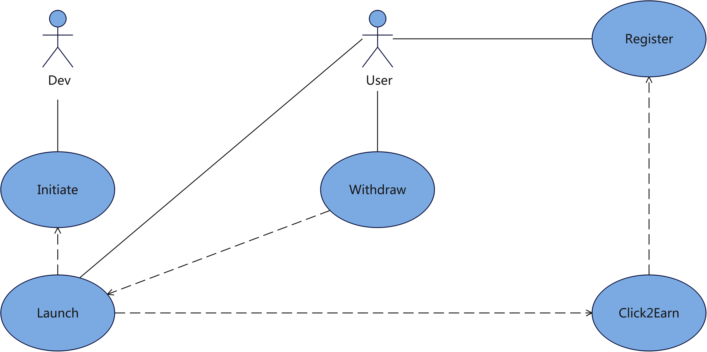
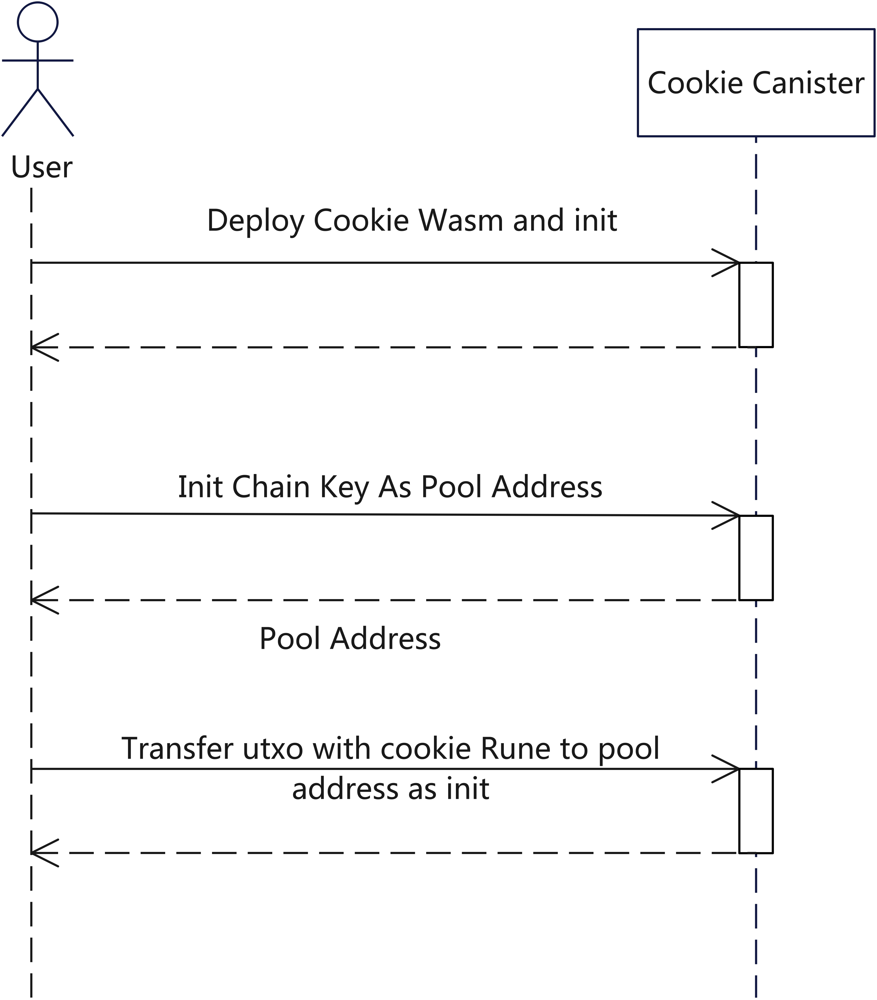
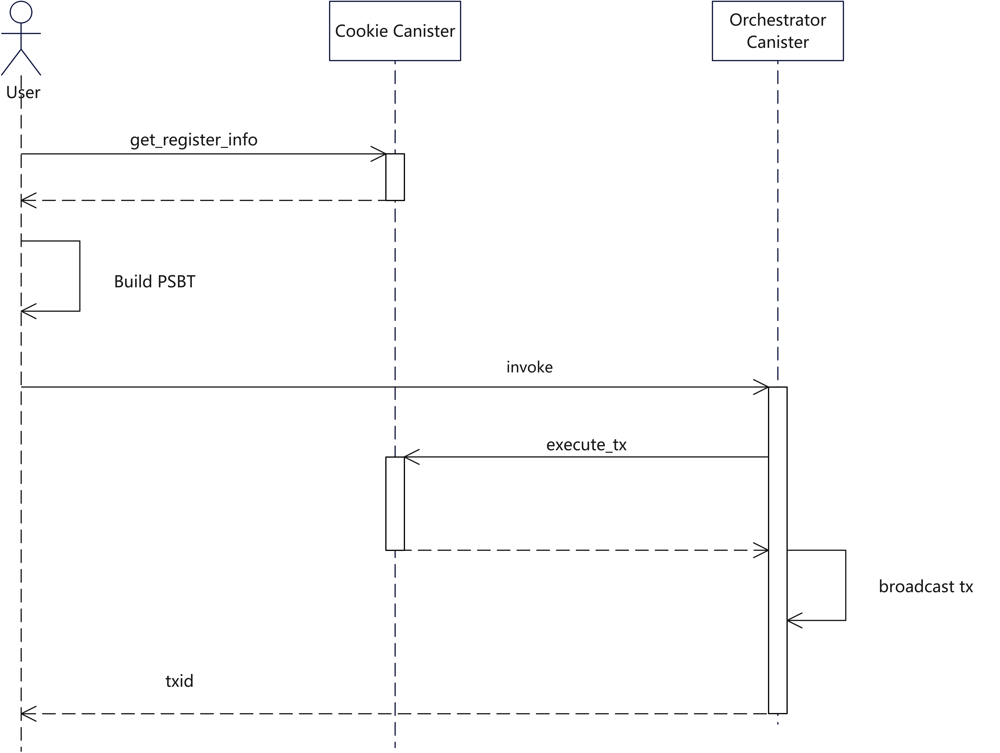
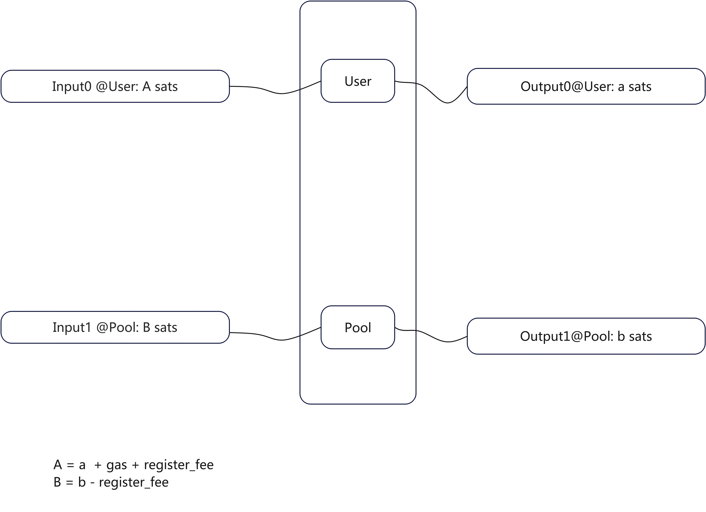
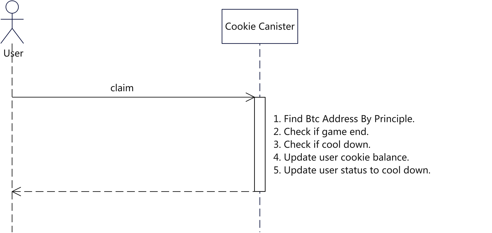
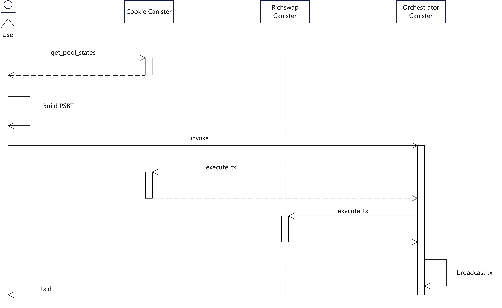
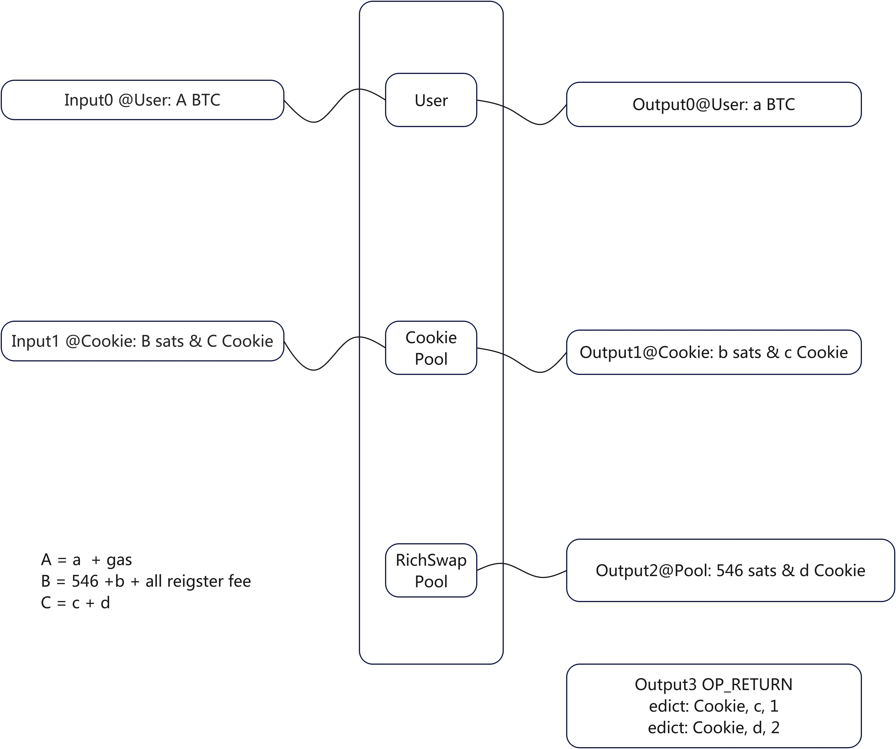
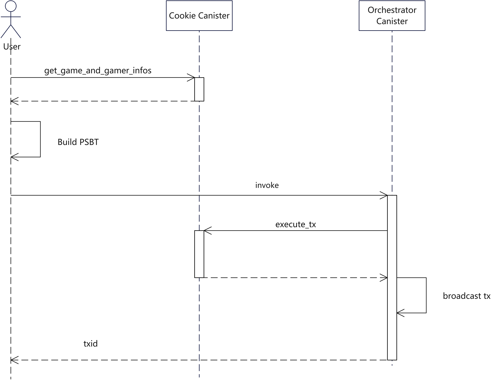
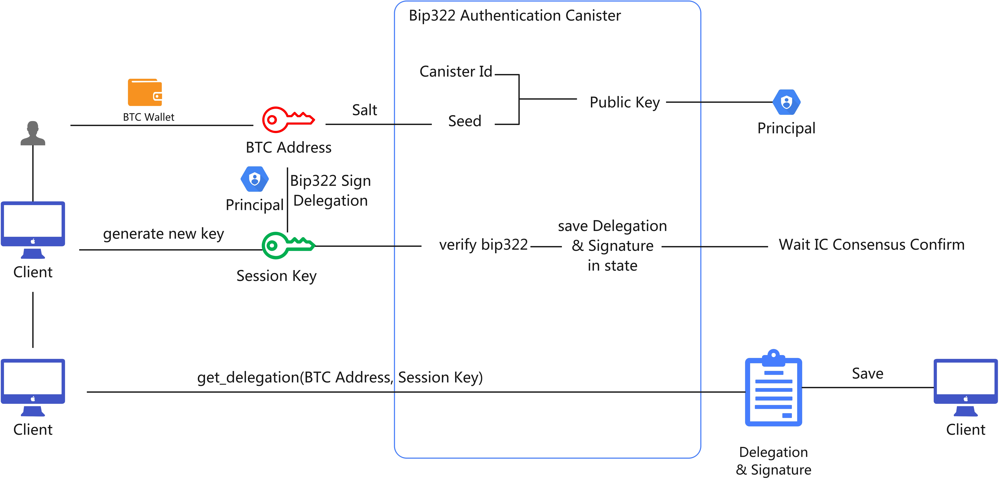

# Ree Game Demo

Unlike Ethereum and other smart contract platforms, Bitcoin's scripting language is not Turing complete, making it extremely challenging—if not impossible—to develop complex applications like AMM protocols directly on the Bitcoin network using BTC scripts and the UTXO model.

REE overcomes this limitation by leveraging the powerful Chain Key technology of the Internet Computer Protocol (ICP) and Bitcoin's Partially Signed Bitcoin Transactions (PSBT) to extend the programmability of Bitcoin's Rune assets.

Ree Game Demo is an example Play-to-Earn project base [REE](https://www.omnity.network/ree) and [SIWB](https://github.com/AstroxNetwork/ic-siwb).

## User Cases

## Implementation

### Init

### Register

### Play Game

### Add Liquidity

### Withdraw

## Siwb

[ic-siwb](https://github.com/AstroxNetwork/ic-siwb)

## Frontend

[The frontend repo](https://github.com/octopus-network/ree-cookie-frontend)
